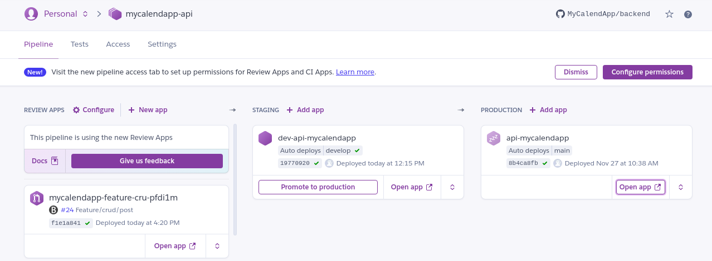

[MyCalendApp](../README.md) > [Architecture](./architecture.md) > [Hebergement](./hosting.md)

# Hebergement

Le projet MyCalendApp est entierement herberger sur [Heroku](https://www.heroku.com).

## Justification du choix de notre solution technique.

>La plateforme Heroku fait tourner nos applications dans des dynos - des conteneurs intelligents qui s'exécutent dans un environnement d'exécution fiable et entièrement géré (service managé). On peut y déployer du code écrit en Node, Ruby, Java, PHP, Python, Go, Scala ou Clojure ou utiliser un buildpack personnalisé pour déployer des applications dans un autre langage de notre choix.

**Pourquoi Heroku ?** Nous nous sommes tourné vers heroku car leur offre d'essai gratuite est idéale pour un project etudiant. Heroku offres égalements un service DNS exposant nos applaciations sur le web directement en HTTPS et ce sur un domain personnalisé.
Enfin Heroku permet la creation d'environnement éphemères nous permettant de poper un environnement à chaque pull request afin de tester nos modifications en conditions réel, via des [pipelines](https://devcenter.heroku.com/articles/pipelines). Ces pipelines permettent également un deployement automatique au merge, ainsi notre branche **develop** est systématiquement deployé sur notre environnement **dev-api-mycalendapp** et la branche **main** sur **api-mycalendapp**. Il en est de meme pour le front en nuxt.

> /!\ Seul inconveniant,mais non génant pour un projet scolaire, de part la gratuité de notre solution, les container applicatifs (dinos) sont killé par heroku au bout de 15 minutes d'inactivité. Un temps de reponse excessivement long sur les premieres requetes peut etre constaté. Il s'agit du temps nécéssaire à Heroku de créer une instance de notre image (reveil du dynos). Aucune persistance de fichier n'est donc possible. Notre solution de contournement est expliqué [ici](./persistance.md).

## Notre pipeline heroku

